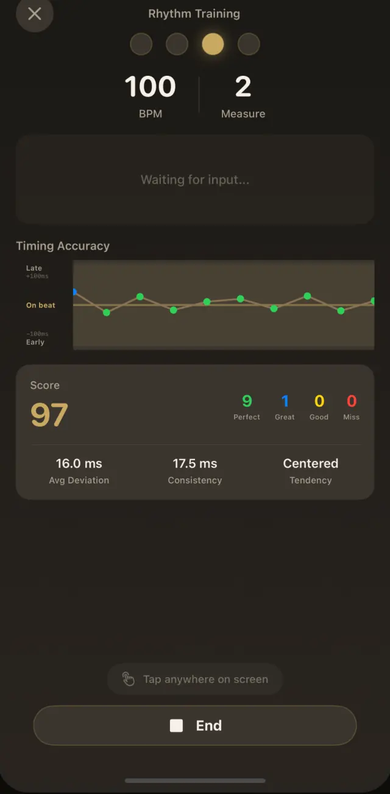
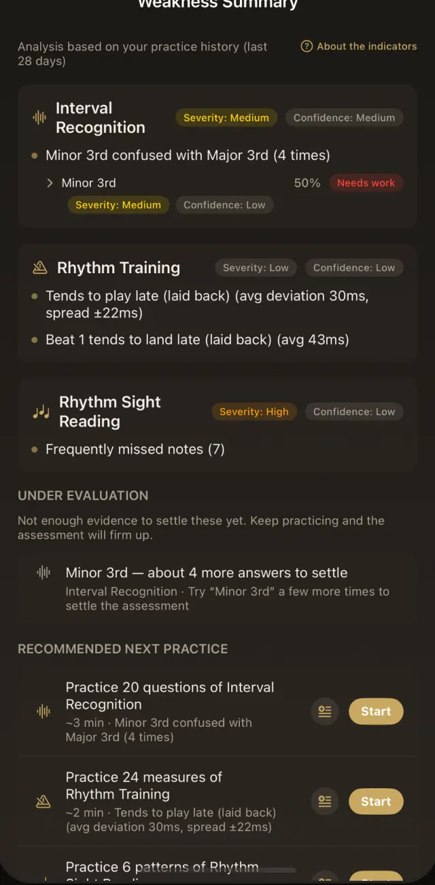
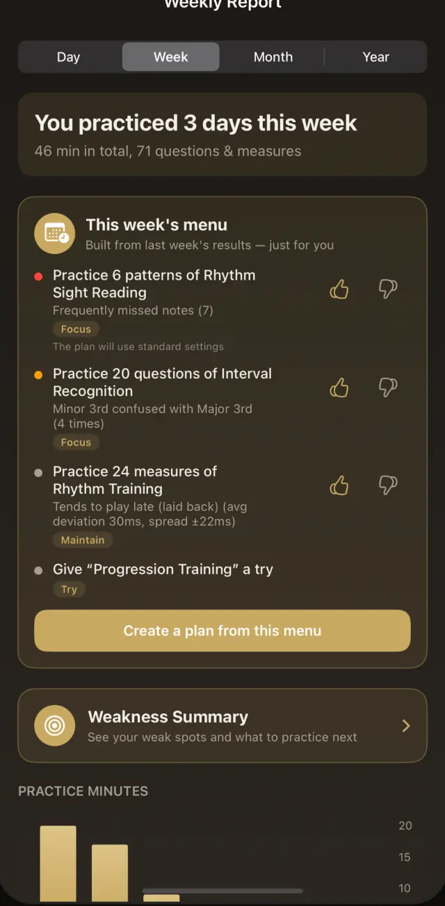
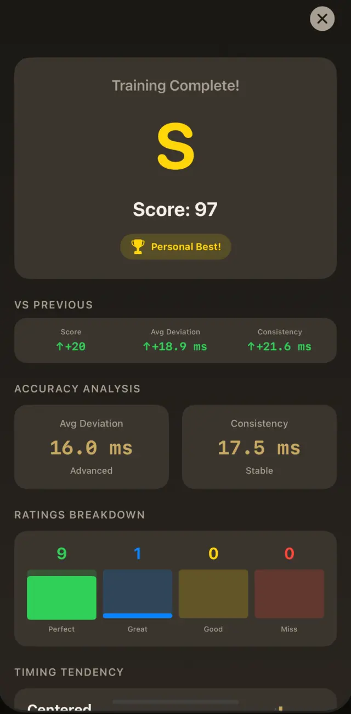

  

  <h1>Solfege PRO</h1>

  
<strong>Hear it. Read it. Feel the rhythm.</strong>

  
Build stronger ears, steadier rhythm, and more confident sight-reading through focused daily practice.

  

    <a href="https://solfegepro.com/"><strong>Website</strong></a>
    ·
    <a href="https://solfegepro.com/en/guides/">Practice Guides</a>
    ·
    <a href="https://solfegepro.com/en/manual/">Manual</a>
  

---

## Practice with purpose

Solfege PRO brings ear training, rhythm, sight-reading, and essential practice tools together in one app. Each session gives you clear feedback, helping you understand not only whether an answer was correct, but where your timing or recognition needs more work.

Practice history is turned into weakness summaries, reports, and recommended next exercises so you can spend less time deciding what to do and more time improving.

## What you can do

- **Train your ear** with interval, chord, scale, and pitch exercises.
- **Develop rhythm and timing** with visual feedback measured against the beat.
- **Improve sight-reading** through focused note and rhythm-reading practice.
- **Understand your progress** with detailed results, weakness summaries, and practice reports.
- **Know what to practise next** through recommendations based on recent sessions.
- **Keep essential tools close** with a tuner, metronome, and other everyday practice utilities.

<table>
  <tr>
    <td align="center"></td>
    <td align="center"></td>
    <td align="center"></td>
    <td align="center"></td>
  </tr>
  <tr>
    <td align="center">Timing analysis</td>
    <td align="center">Weakness summary</td>
    <td align="center">Weekly report</td>
    <td align="center">Result analysis</td>
  </tr>
</table>

## Explore Solfege PRO

| Resource | What you will find |
| --- | --- |
| [Official website](https://solfegepro.com/en/) | Discover the app and its key capabilities |
| [Practice guides](https://solfegepro.com/en/guides/) | Evidence-informed guidance for ear training, rhythm, and reading music |
| [Where to start](https://solfegepro.com/en/start-here/) | Find a starting point based on your goals and current difficulties |
| [User manual](https://solfegepro.com/en/manual/) | Learn how to use each part of the app |
| [Features and pricing](https://solfegepro.com/en/features/) | Compare features and plan information |

The app, official website, practice guides, and policies are available in Japanese, English, French, German, Spanish, Italian, Korean, and Brazilian Portuguese.

## Get the app

Start building your core music skills with Solfege PRO.

<table>
  <tr>
    <td align="center">
      
    </td>
    <td align="center"><strong>Android</strong> Coming soon</td>
  </tr>
</table>

[Visit the official website](https://solfegepro.com/en/)

## Support and policies

- [Support](https://solfegepro.com/en/support/)
- [Terms of Use](https://solfegepro.com/en/terms/)
- [Privacy Policy](https://solfegepro.com/en/privacy/)

---

  © 2026 Solfege PRO. All rights reserved.

